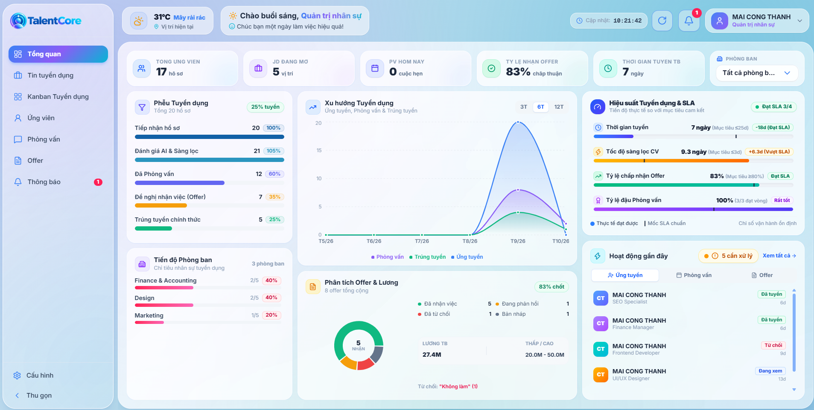
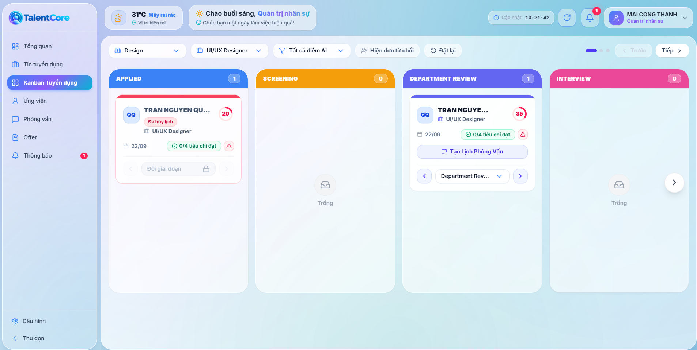
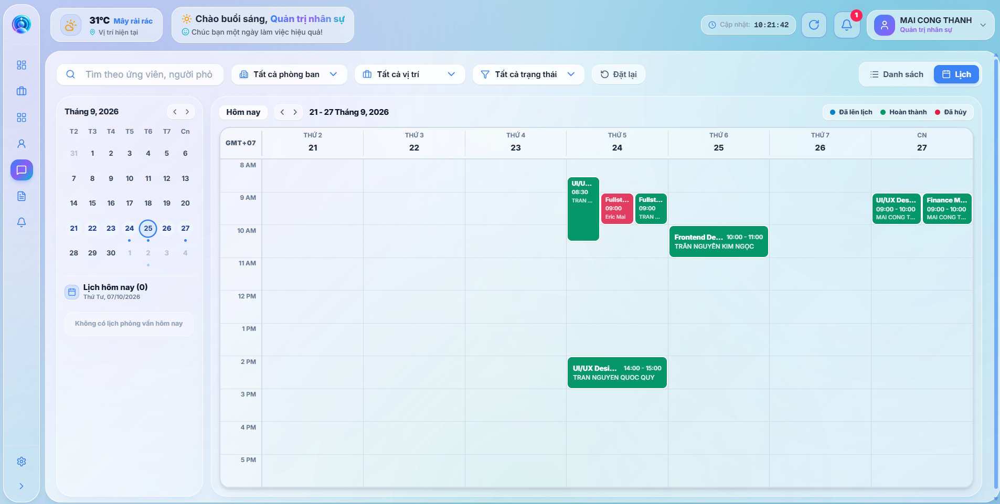
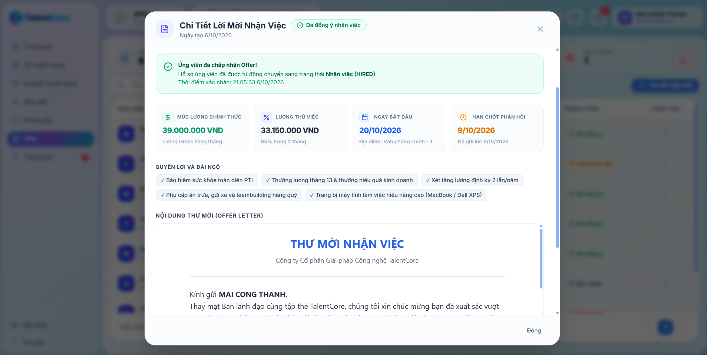
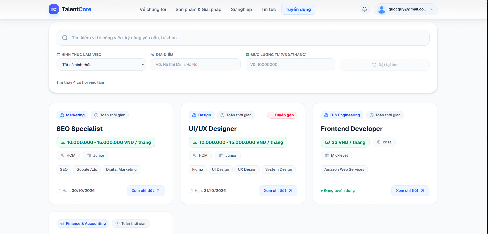
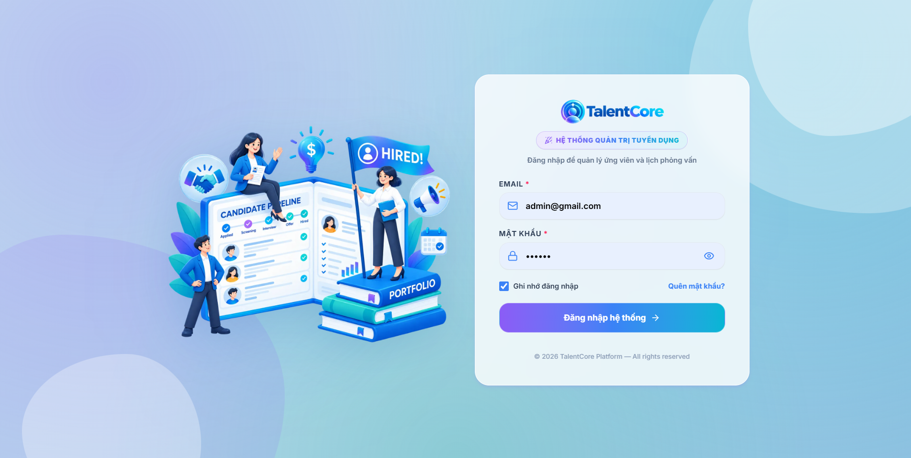
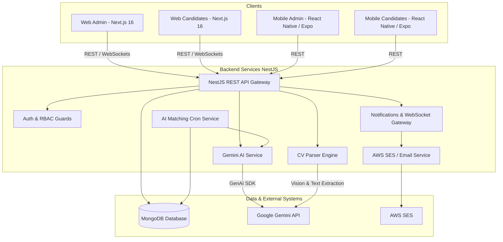

<p align="center">
  
</p>

<h1 align="center">🚀 TalentCore — Hệ Thống Quản Lý Tuyển Dụng Thông Minh (Smart ATS)</h1>

<p align="center">
  <b>Nền tảng Quản lý Tuyển dụng Toàn diện tích hợp Trí tuệ Nhân tạo (AI-Powered Applicant Tracking System)</b>
</p>

<p align="center">
  
  
  
  
  
  
  
  
</p>

---

## 📌 Giới Thiệu (Overview)

**TalentCore** là hệ thống quản lý tuyển dụng doanh nghiệp thế hệ mới (Next-Gen Applicant Tracking System - ATS), kết hợp sức mạnh của **Trí tuệ nhân tạo (Google Gemini AI)**, kiến trúc **Microservices / Multi-Platform** (Web Admin, Web Cổng tuyển dụng, Mobile App cho HR & Ứng viên). 

Hệ thống giúp tối ưu hóa toàn bộ quy trình tuyển dụng từ soạn thảo JD, tự động bóc tách và chấm điểm CV ứng viên, quản lý quy trình tuyển dụng dạng Kanban kéo thả, sắp xếp lịch phỏng vấn thông minh, cho đến phát hành Thư mời nhận việc (Offer Letter).

---

## 📸 Hình Ảnh Giao Diện Dự Án (Screenshots & Showcase)

### 1. 📊 Tổng Quan & Phân Tích Tuyển Dụng (Dashboard & Analytics)
> Giao diện hiển thị chỉ số tổng quan: số lượng vị trí tuyển dụng, ứng viên mới, tỷ lệ phỏng vấn, biểu đồ phân tích nguồn ứng viên và xu hướng tuyển dụng theo thời gian thực.
<p align="center">
  
</p>

---

### 2. 📋 Quy Trình Tuyển Dụng Dạng Kanban (Drag & Drop Pipeline)
> Trực quan hóa hành trình của ứng viên qua từng giai đoạn (Ứng tuyển, Sàng lọc, Phỏng vấn Chuyên môn, Phỏng vấn HR, Đề nghị nhận việc, Nhận việc). Tích hợp kéo thả mượt mà cùng hệ thống chấm điểm AI Matching Score.
<p align="center">
  
</p>

---

### 3. 📅 Lịch Phỏng Vấn & Quản Lý Lịch Làm Việc (Interview Scheduling)
> Quản lý lịch phỏng vấn theo giao diện Lịch (Calendar View). Đặt lịch phỏng vấn, phân công người phỏng vấn (Interviewer), gửi thư mời tự động và ghi nhận đánh giá phỏng vấn.
<p align="center">
  
</p>

---

### 4. 📜 Quản Lý Thư Mời Nhận Việc (Offer Letter Management)
> Tạo và quản lý thư mời nhận việc với quy trình phê duyệt nhiều cấp (Hiring Manager -> HR Director), tự động điền thông tin lương thưởng và gửi thư tới ứng viên.
<p align="center">
  
</p>

---

### 5. 🌐 Cổng Thông Tin Tuyển Dụng Dành Cho Ứng Viên (Candidate Career Portal)
> Cổng thông tin việc làm hiện đại dành cho ứng viên: tìm kiếm công việc, xem chi tiết JD, nộp CV trực tuyến với tính năng tự động trích xuất thông tin bằng AI.
<p align="center">
  
</p>

---

### 6. 🔐 Hệ Thống Đăng Nhập & Phân Quyền Bảo Mật (Authentication & Access Control)
> Giao diện đăng nhập an toàn hỗ trợ phân quyền chi tiết cho nhiều vai trò: Quản trị viên (Admin), Chuyên viên tuyển dụng (Recruiter), Trưởng bộ phận (Hiring Manager), Người phỏng vấn (Interviewer) và Ứng viên (Candidate).
<p align="center">
  
</p>

---

## ✨ Tính Năng Nổi Bật (Key Features)

### 🤖 1. Trí Tuệ Nhân Tạo AI (Powered by Google Gemini 3.6 / 3.8 Flash)
* **Smart CV Parser**: Tự động đọc và bóc tách thông tin từ các định dạng file CV (PDF, DOCX, Ảnh scan PNG/JPG) thành dữ liệu cấu trúc (Họ tên, Liên hệ, Số năm kinh nghiệm, Kỹ năng, Lịch sử làm việc, Học vấn, Dự án, Chứng chỉ).
* **AI Candidate Matching & Scoring**: Tự động so sánh hồ sơ ứng viên với yêu cầu công việc (Job Description), tính toán điểm phù hợp (%) dựa trên các tiêu chí Bắt buộc (Mandatory) và Ưu tiên (Preferred).
* **AI JD Generator**: Tự động soạn thảo Mô tả công việc (JD) chuyên nghiệp chỉ trong vài giây từ các thông tin cơ bản.
* **Smart Criteria Weight Suggestion**: Gợi ý phân bổ trọng số % giữa các tiêu chí đánh giá tuyển dụng tối ưu cho từng vị trí.

### 💼 2. Quản Lý Tuyển Dụng Cho HR & Nhà Tuyển Dụng (Web Admin & Mobile Admin)
* **Dashboard Analytics**: Thống kê số lượng hồ sơ, thời gian tuyển dụng trung bình (Time-to-hire), tỷ lệ chuyển đổi các vòng tuyển dụng.
* **Kanban Pipeline Kéo Thả**: Quản lý hồ sơ ứng viên trực quan với công nghệ `@dnd-kit`, chuyển giai đoạn hồ sơ tức thì.
* **Interview Calendar**: Đặt lịch phỏng vấn online/offline, gửi mail kèm file lịch (.ics), quản lý phiếu đánh giá phỏng vấn.
* **Offer Management**: Soạn thảo và duyệt Offer Letter trực tiếp trên hệ thống với quy trình duyệt tự động.
* **Cấu hình Template**: Cho phép tùy chỉnh Quy trình tuyển dụng (Pipeline Templates) và Mẫu Email gửi tự động (Email Templates).

### 🎯 3. Cổng Tuyển Dụng & Ứng Dụng Dành Cho Ứng Viên (Web & Mobile Candidate)
* **Career Site Responsive**: Tra cứu danh sách công việc đang tuyển, lọc theo phòng ban, địa điểm, mức lương.
* **Nộp CV 1-Click**: Tự động nhận diện CV và điền thông tin vào form ứng tuyển.
* **Theo Dõi Trạng Thái**: Ứng viên có thể theo dõi tiến độ hồ sơ, nhận thông báo phỏng vấn và phản hồi Offer trực tiếp trên portal hoặc ứng dụng di động.

### 🔔 4. Thông Báo Real-time & Email Tự Động
* **Real-time WebSockets**: Thông báo tức thì khi có ứng viên mới ứng tuyển, có cập nhật lịch phỏng vấn hoặc duyệt JD/Offer.
* **Hệ thống Email (AWS SES / Nodemailer)**: Gửi thông báo tự động cho ứng viên và thành viên hội đồng tuyển dụng.

---

## 🏗 Architecture & Structural Overview



---

## 📂 Cấu Trúc Thư Mục Dự Án (Project Structure)

```text
TalentCore/
├── assets/                       # Chứa tài nguyên hình ảnh minh họa cho README
│   ├── talentcore-dashboard.png
│   ├── talentcore-kanban.png
│   ├── talentcore-calendar.png
│   ├── talentcore-offer.png
│   ├── talentcore-career.png
│   └── talentcore-login.png
├── backend/                      # Backend Service (NestJS + TypeScript + MongoDB)
│   ├── src/
│   │   ├── modules/              # Các Module nghiệp vụ (Auth, Candidates, Applications, JDs, Interviews, Offers...)
│   │   ├── main.ts               # File khởi chạy server
│   │   └── app.module.ts         # Root Module
│   └── package.json
├── frontend-admin/               # Web App dành cho HR / Recruiter (Next.js 16 + React 19 + Tailwind CSS)
│   ├── src/
│   │   ├── app/                  # App Router (Dashboard, Kanban, Calendar, Offers, Settings...)
│   │   ├── components/           # UI Components (@dnd-kit, Recharts, Modals...)
│   │   └── services/             # API client integration
│   └── package.json
├── frontend-candidates/          # Web App Cổng tuyển dụng Ứng viên (Next.js 16 + React 19)
│   ├── src/
│   │   ├── app/                  # App Router (Jobs search, Job detail, Application Form...)
│   └── package.json
├── mobile-admin/                 # Mobile App Quản trị dành cho HR (React Native + Expo 57)
│   ├── app/                      # Expo Router screens
│   └── package.json
└── mobile-candidates/            # Mobile App dành cho Ứng viên (React Native + Expo 57)
    ├── app/                      # Expo Router screens
    └── package.json
```

---

## 🛠 Công Nghệ Sử Dụng (Tech Stack)

| Phân hệ | Công nghệ / Thư viện chính |
| :--- | :--- |
| **Backend** | NestJS, TypeScript, MongoDB (Mongoose), Google GenAI SDK (`@google/genai`), Socket.IO, AWS SES, Mammoth, PDF-parse, Multer |
| **Frontend Admin** | Next.js 16 (App Router), React 19, Tailwind CSS v4, `@dnd-kit` (Kanban), Recharts, Lucide React, React Hook Form, Zod |
| **Frontend Candidate** | Next.js 16, React 19, Tailwind CSS v4, Jodit React, React Hot Toast |
| **Mobile Apps** | React Native 0.86, Expo 57, Expo Router, React Native Reanimated 4, Async Storage |
| **Database & Cloud** | MongoDB Atlas / Local MongoDB, AWS SES (Simple Email Service), Google Gemini AI API |

---

## 🚀 Hướng Dẫn Cài Đặt & Khởi Chạy (Getting Started)

### 📋 Yêu cầu tiên quyết (Prerequisites)
* **Node.js**: `v18.x` hoặc cao hơn
* **npm** hoặc **yarn** / **pnpm**
* **MongoDB**: Cài đặt MongoDB Local hoặc có tài khoản MongoDB Atlas
* **Google Gemini API Key**: Đăng ký API Key tại [Google AI Studio](https://aistudio.google.com/)

---

### 1. Khởi Chạy Backend (NestJS Server)

```bash
# Di chuyển vào thư mục backend
cd backend

# Cài đặt dependencies
npm install

# Tạo file .env và cấu hình các biến môi trường
cp .env.example .env
```

**Cấu hình file `.env` mẫu trong `backend/.env`:**
```env
PORT=3000
MONGODB_URI=mongodb://localhost:27017/talentcore
JWT_SECRET=your_super_secret_jwt_key
GEMINI_API_KEY=your_google_gemini_api_key

# Cấu hình Email (SES hoặc SMTP)
AWS_REGION=ap-southeast-1
AWS_ACCESS_KEY_ID=your_aws_access_key
AWS_SECRET_ACCESS_KEY=your_aws_secret_key
MAIL_FROM=no-reply@talentcore.vn
```

**Khởi chạy Backend ở chế độ Development:**
```bash
npm run dev
# Server sẽ chạy tại: http://localhost:3000
```

---

### 2. Khởi Chạy Frontend Admin (Web Quản Trị Tuyển Dụng)

```bash
# Di chuyển vào thư mục frontend-admin
cd ../frontend-admin

# Cài đặt dependencies
npm install

# Khởi chạy ứng dụng Web Admin
npm run dev
# Ứng dụng sẽ chạy tại: http://localhost:3000 (hoặc port khả dụng tiếp theo)
```

---

### 3. Khởi Chạy Frontend Candidates (Web Cổng Tuyển Dụng)

```bash
# Di chuyển vào thư mục frontend-candidates
cd ../frontend-candidates

# Cài đặt dependencies
npm install

# Khởi chạy Cổng tuyển dụng Ứng viên
npm run dev
# Ứng dụng sẽ chạy tại: http://localhost:3001
```

---

### 4. Khởi Chạy Mobile Admin & Mobile Candidates (React Native / Expo)

```bash
# Khởi chạy Mobile Admin
cd ../mobile-admin
npm install
npx expo start

# Khởi chạy Mobile Candidates
cd ../mobile-candidates
npm install
npx expo start
```

---

## 📝 Giấy Phép & Tác Giả (License & Credits)

- **Dự án**: TalentCore - Hệ Thống Quản Lý Tuyển Dụng Thông Minh (Smart ATS)
- **Báo cáo Khóa luận Tốt nghiệp / Đồ án**
- **Bản quyền**: © 2026 TalentCore Team. All rights reserved.

---

<p align="center">
  <b>⭐ Nếu bạn thấy dự án hữu ích, hãy tặng dự án 1 Star trên GitHub nhé! ⭐</b>
</p>
